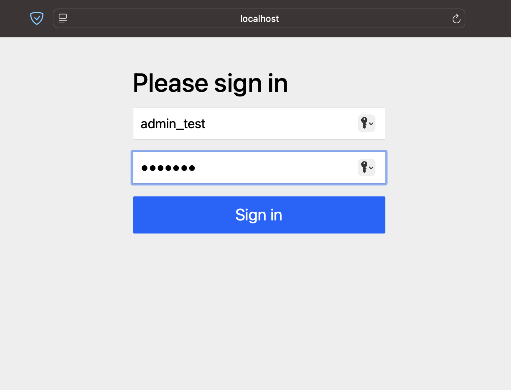
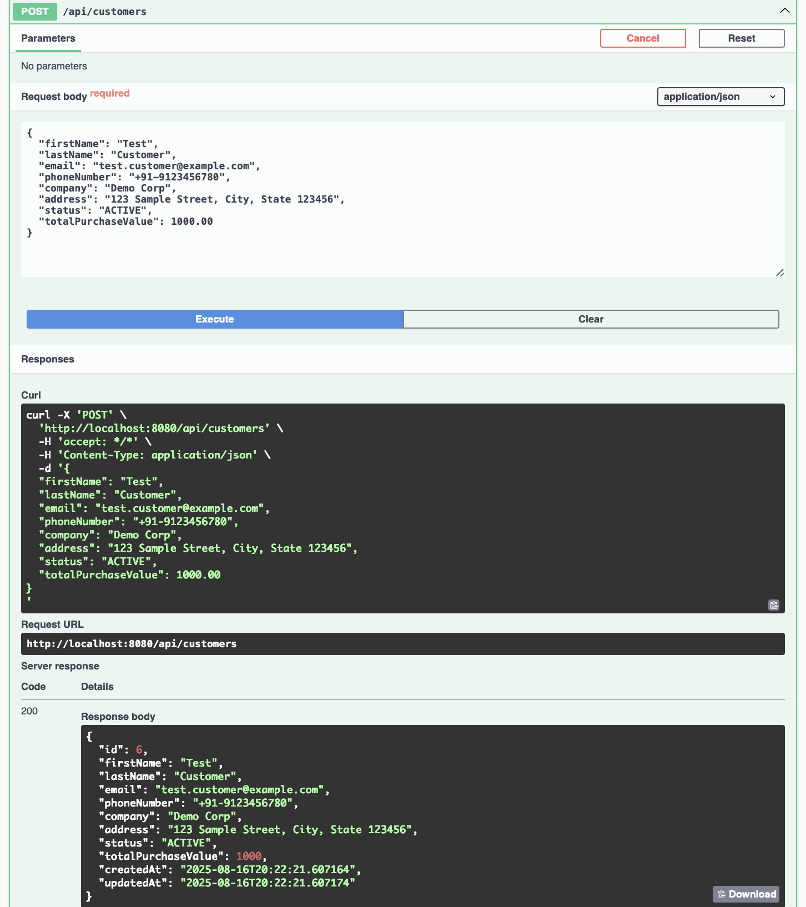
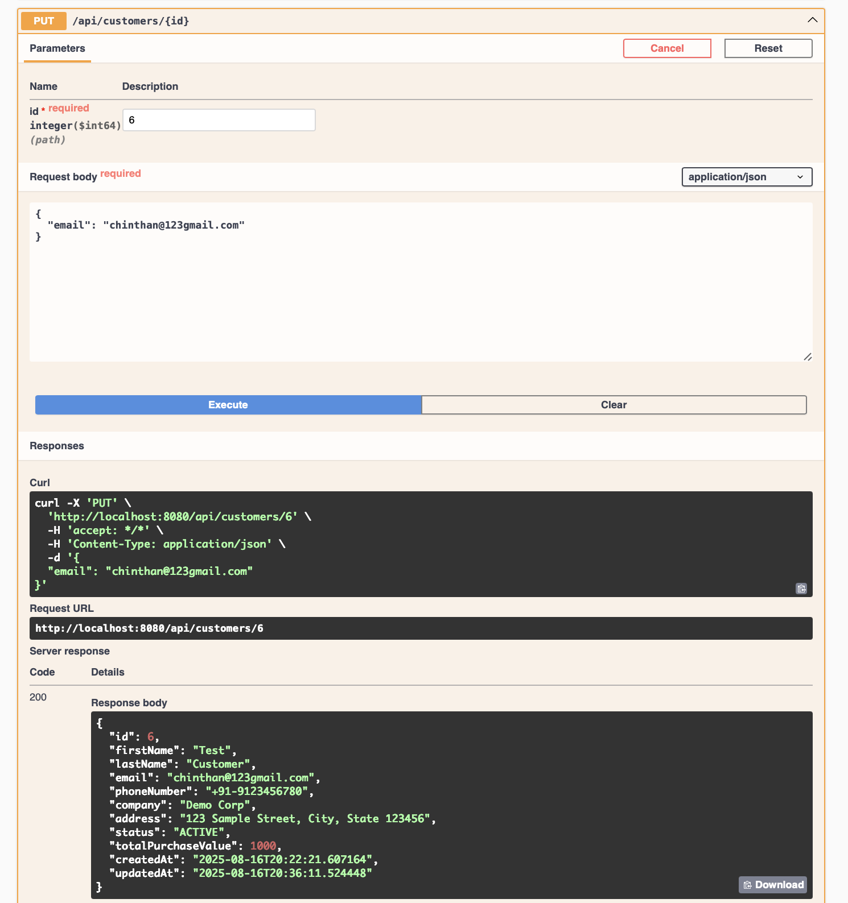
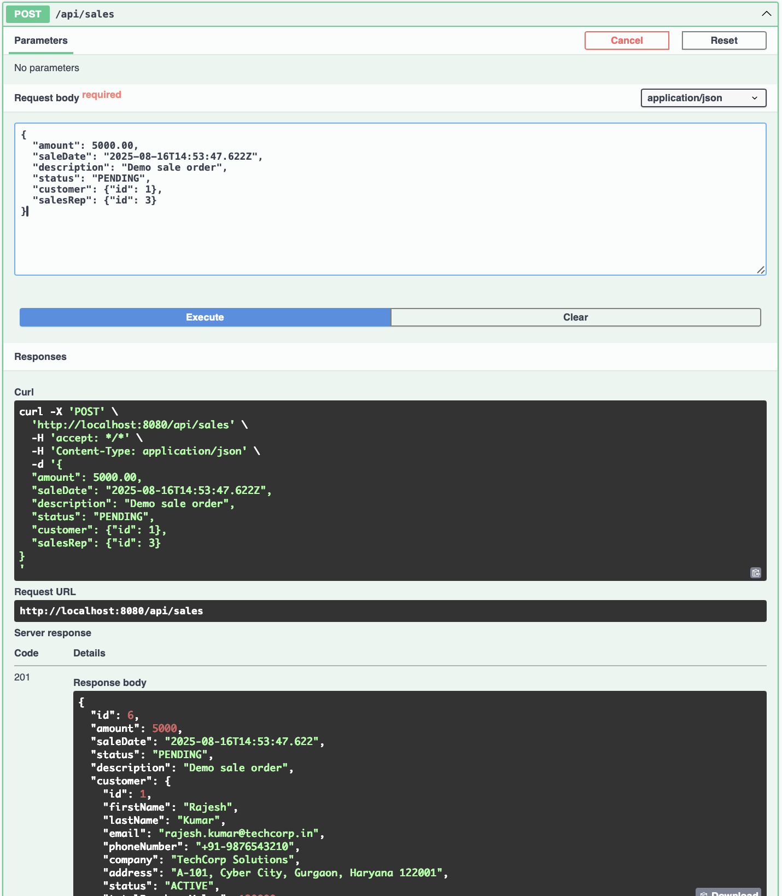

# Customer Relationship Management (CRM) System

A comprehensive Java Spring Boot application for managing customer relationships, sales operations, and user interactions with role-based authentication and hierarchical management structure.

## Project Overview

This CRM system is built using modern Java technologies and follows enterprise-grade architectural patterns. The application provides a complete solution for businesses to manage their customer relationships, track sales performance, and monitor team interactions efficiently.

## Key Features

**Core Business Functions:**
- Customer lifecycle management with comprehensive profiles
- Sales pipeline tracking with amount and status management
- Multi-channel interaction logging (calls, emails, meetings, support tickets)
- Hierarchical user management with role-based permissions

**Security & Access Control:**
- Spring Security integration with method-level authorization
- Role-based access control: ADMIN, MANAGER, SALES_REP, SUPPORT
- Secure API endpoints with appropriate permission levels

**Operational Features:**
- Real-time dashboards for administrators and managers
- Automated data initialization for development and testing
- Comprehensive logging and audit trails
- RESTful API architecture with proper HTTP status codes

## Technical Architecture

### Technology Stack
- **Framework:** Spring Boot 3.5.4
- **Language:** Java 17
- **Database:** MySQL with JPA/Hibernate ORM
- **Security:** Spring Security 6
- **Documentation:** SpringDoc OpenAPI 3 (Swagger)
- **Build Tool:** Maven

### Database Schema
```sql
-- Core entities with relationships
users (id, user_name, email, password, role, manager_id, status, timestamps)
customer_details (id, name, email, company, status, total_purchase_value, timestamps)
sale_details (id, amount, sale_date, status, customer_id, sales_rep_id, timestamps)
customer_interactions (id, type, interaction_date, notes, customer_id, user_id, timestamps)
```

### Project Structure
```
src/
 |- main/
 |   |- java/org/assignment/crm/
 |   |   |- config/         # Security & data initialization configuration
 |   |   |- controller/     # REST controllers for APIs
 |   |   |- entity/         # JPA Entities (Customer, Sale, User, Interaction, etc.)
 |   |   |- enums/          # Enum types for statuses and roles
 |   |   |- exception/      # Exception handlers (GlobalExceptionHandler)
 |   |   |- repository/     # Spring Data JPA repositories
 |   |   └- service/        # Business/services logic
 |   |- resources/
 |       └- application.properties
```

## Getting Started

### Prerequisites
- Java 17 or higher
- Maven 3.8+
- MySQL 8.0+

### Database Setup
```sql
CREATE DATABASE crm_system;
CREATE USER 'crm_user'@'localhost' IDENTIFIED BY 'your_password';
GRANT ALL PRIVILEGES ON crm_system.* TO 'crm_user'@'localhost';
FLUSH PRIVILEGES;
```

### Application Configuration
Update `src/main/resources/application.properties`:
```properties
spring.datasource.url=jdbc:mysql://localhost:3306/crm_system
spring.datasource.username=crm_user
spring.datasource.password=your_password
spring.jpa.hibernate.ddl-auto=update
server.port=8080
```

### Build and Run
```bash
# Clone the repository
git clone https://github.com/chinthan22222/Customer-Relationship-Management.git
cd Customer-Relationship-Management

# Build the application
./mvnw clean install

# Run the application
./mvnw spring-boot:run
```

### Demo Users & Sample Data

The application includes a **DataInitializer** component that automatically creates comprehensive sample data on first startup:

**Default User Accounts:**
| Username | Password | Role | Name | Reports To | Email |
|----------|----------|------|------|------------|-------|
| `admin_test` | `demo123` | ADMIN | System Admin | - | admin.test@company.com |
| `manager_test` | `demo123` | MANAGER | Team Manager | - | manager.test@company.com |
| `sales_demo1` | `demo123` | SALES_REP | Chinthan Sales | manager_test | sales1@company.com |
| `sales_demo2` | `demo123` | SALES_REP | Regional Rep | manager_test | sales2@company.com |
| `support_demo` | `demo123` | SUPPORT | Customer Support | manager_test | support@company.com |

**Sample Customers Created:**
| Name | Company | Location | Phone | Purchase Value |
|------|---------|----------|--------|----------------|
| Rajesh Kumar | TechCorp Solutions | Gurgaon, Haryana | +91-9876543210 | 1,25,000.00 |
| Priya Sharma | InnovateTech Industries | Pune, Maharashtra | +91-9823456789 | 2,75,000.50 |
| Arjun Patel | Digital Solutions Pvt Ltd | Bangalore, Karnataka | +91-9765432108 | 89,000.25 |
| Anita Singh | Enterprise Systems Ltd | Noida, Uttar Pradesh | +91-9654321098 | 3,20,000.00 |
| Vikram Reddy | TechSys Corporation | Chennai, Tamil Nadu | +91-9543210987 | 0.00 (Inactive) |

**Sample Sales Records:**
- **CRM Software License** - 50,000.00 (Completed)
- **ERP Implementation Services** - 1,25,000.50 (Completed)
- **Digital Transformation Package** - 89,000.25 (Completed)
- **Enterprise Cloud Solution** - 2,20,000.00 (Pending)
- **Annual Maintenance Contract** - 75,000.00 (Canceled)

**Customer Interactions:**
- Initial product demo and requirement discussion (Call)
- Sent detailed proposal with pricing structure (Email)
- Requirements gathering and solution architecture (Meeting)
- Technical support for implementation queries (Support Ticket)
- Contract renewal discussion and terms (Email)

**Manager Hierarchy:**
- All sales representatives and support staff report to the Team Manager
- Demonstrates realistic organizational structure for Indian IT companies
- Enables team-based dashboard views and performance tracking across major Indian tech hubs

*Note: All sample data reflects Indian business context with realistic company names, locations, phone numbers, and transaction amounts in Indian Rupees.*

## API Documentation

The application includes comprehensive API documentation available at:
- **Swagger UI:** http://localhost:8080/swagger-ui.html
- **OpenAPI Specification:** http://localhost:8080/v3/api-docs

### Core API Endpoints

**Customer Management**
- `GET /api/customers` - List all customers
- `POST /api/customers` - Create new customer
- `GET /api/customers/{id}` - Get customer by ID
- `PUT /api/customers/{id}` - Update customer
- `DELETE /api/customers/{id}` - Delete customer

**Sales Management**
- `GET /api/sales` - List all sales
- `POST /api/sales` - Create new sale
- `PUT /api/sales/{id}` - Update sale

**User Management**
- `GET /api/users` - List users (Admin only)
- `POST /api/users` - Create user (Admin only)
- `PUT /api/users/{userId}/manager/{managerId}` - Assign manager

**Analytics & Reporting**
- `GET /api/dashboard/admin` - Administrator dashboard
- `GET /api/dashboard/manager/{id}` - Manager dashboard

## Application Screenshots

The following screenshots demonstrate the key features and user interface of the CRM system:

<details>
<summary>Authentication & Login</summary>


*Secure login interface with role-based authentication*

</details>

<details>
<summary>API Documentation</summary>


*Complete API documentation with interactive testing capabilities*

</details>

<details>
<summary>Dashboard & Analytics</summary>


*Admin Dashboard metrics*


*Manager Dashboard metrics*

</details>

<details>
<summary>Customer Management</summary>


*Customer overview with search and filtering capabilities*


*Customer management API endpoints and operations*


*logging and history tracking*

</details>

<details>
<summary>Sales & Operations</summary>


*Sales management API endpoints and functionality*


*Sales pipeline tracking and status management*

</details>

<details>
<summary>User & System Management</summary>


*User management API endpoints and role-based administration*

</details>

<details>
<summary>Customer Creation/Edit Form</summary>


*creating new customers*


*Updating existing customers*

</details>

<details>
<summary>Sales Creation Form</summary>


*creating/adding new sale*

</details>


## Security Configuration

The application implements comprehensive security measures:

**Authentication Methods:**
- HTTP Basic Authentication for API access
- Form-based authentication for web interface

**Authorization Levels:**
- **ADMIN:** Full system access, user management, system configuration
- **MANAGER:** Team oversight, performance metrics, customer management
- **SALES_REP:** Customer and sales management within assigned scope
- **SUPPORT:** Customer interaction logging and support ticket management

**Security Features:**
- Method-level security with `@PreAuthorize` annotations
- Secure password encoding using BCrypt
- Session management and timeout handling
- CSRF protection for state-changing operations

## Development Features

**Data Initialization:**
The application includes automatic data seeding through the `DataInitializer` component, which creates a complete set of sample data including users with manager relationships, Indian customers from major tech companies across different cities (Gurgaon, Pune, Bangalore, Noida, Chennai), sales records with realistic Indian Rupee amounts, and customer interactions across multiple channels.

**Logging Configuration:**
- Structured logging with configurable levels
- File-based logging with rotation
- Request/response logging for API endpoints

**Exception Handling:**
- Global exception handler for consistent error responses
- Custom exceptions for business logic violations
- Detailed error messages for development and debugging

## Testing

The application includes comprehensive test coverage:
```bash
# Run unit tests
./mvnw test

# Run integration tests
./mvnw integration-test
```

## Deployment Considerations

**Production Configuration:**
- Use environment-specific configuration files
- Implement proper database connection pooling
- Configure SSL/TLS for secure communications
- Set up monitoring and health checks via Spring Boot Actuator

**Performance Optimization:**
- Database indexing on frequently queried columns
- JPA query optimization with proper fetch strategies
- Caching implementation for frequently accessed data
- Connection pool tuning based on load requirements

---

**Project Statistics:**
- Language: 100% Java
- Framework: Spring Boot 3.5.4
- Database: MySQL with JPA/Hibernate
- Security: Spring Security 6
- Build Tool: Maven
